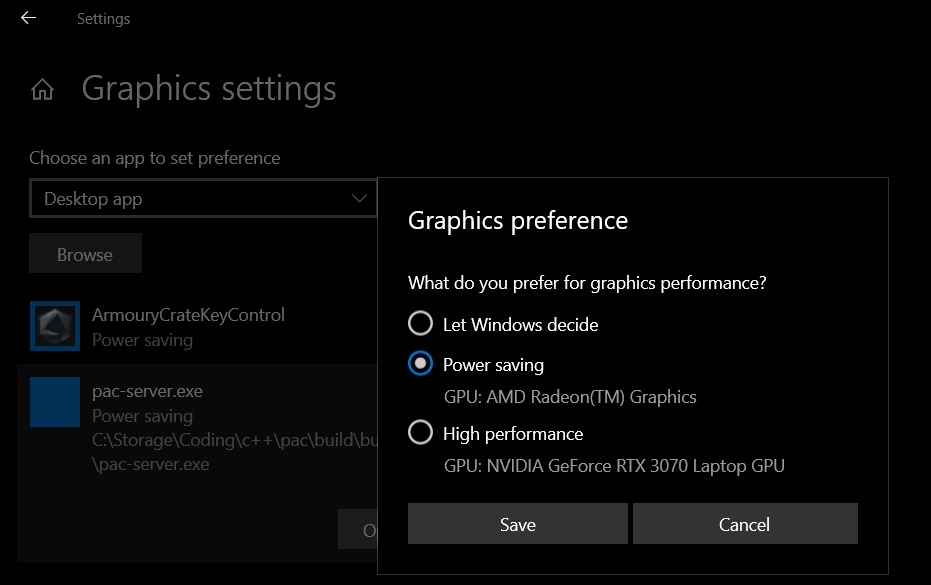

# PAC - Portals Across Computers
<p align="center"><a href="https://vuejs.org" target="_blank" rel="noopener noreferrer"></a></p>

## Prerequisite
- CMake
- Ninja or Visual Studio 2019
- g++ or Visual Studio 2019

## Dependencies
- Downloaded, built, linked by CMake, view dependencies/CMakeLists.txt

## Building
### Client and Server
**cd build**

### Debug
###### Windows


```shell
cmake -G "Visual Studio 16 2019" -A x64 -S ../ -B "build64"
```

```shell
cmake --build "build64" --config Debug
```

###### Linux:

```shell
cmake -G "Ninja" -S ../ -B "build64/Debug" -D CMAKE_BUILD_TYPE=Debug
```

```shell
cmake --build "build64/Debug"
```

<br>

### Release
###### Windows


```shell
cmake -G "Visual Studio 16 2019" -A x64 -S ../ -B "build64"
```

```shell
cmake --build "build64" --config Release
```

###### Linux:

```shell
cmake -G "Ninja" -S ../ -B "build64/Release" -D CMAKE_BUILD_TYPE=Release
```

```shell
cmake --build "build64/Release"
```

### Gstreamer screen capture

- Windows: `gst-launch-1.0 dxgiscreencapsrc cursor=true ! video/x-raw,framerate=60/1 ! videoscale method=0 ! videoconvert ! autovideosink sync=false`
- Linux: `gst-launch-1.0 ximagesrc startx=0 starty=0 use-damage=0 xid=83886082 ! video/x-raw,framerate=60/1 ! videoscale method=0 ! video/x-raw,width=1920,height=1080  ! autovideosink sync=false`

### FAQ
Q: Pac-server cannot record / find monitor X   
A: Your are most likely using a hybrid graphics system (integrated gpu + external gpu). You need to set the Graphics performance preference to "low power (integrated gpu)" for pac-server.exe
